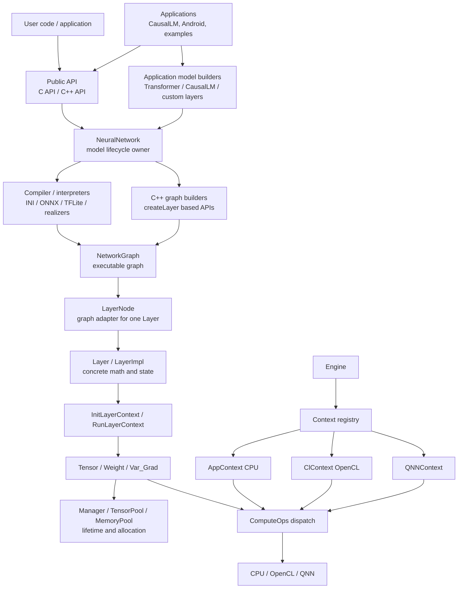
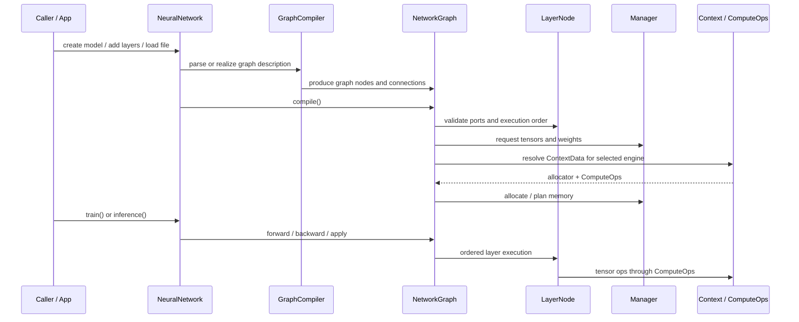
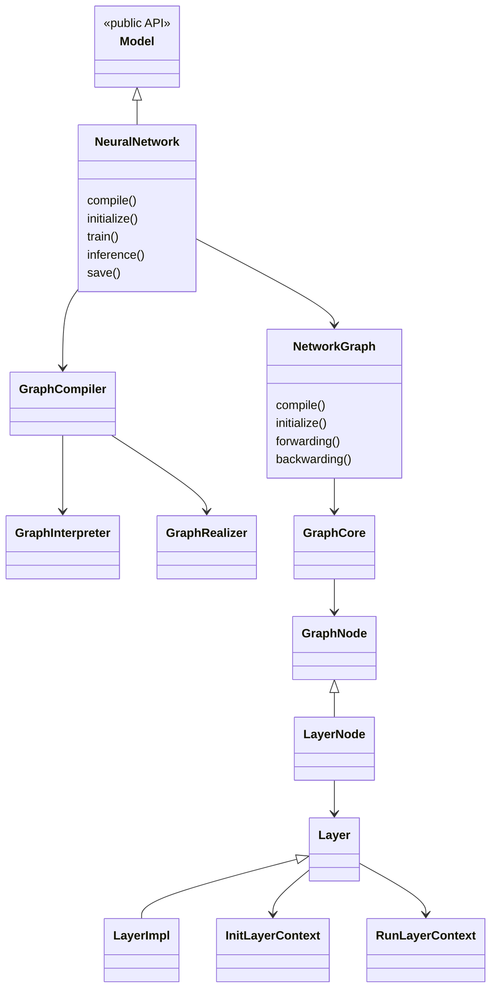
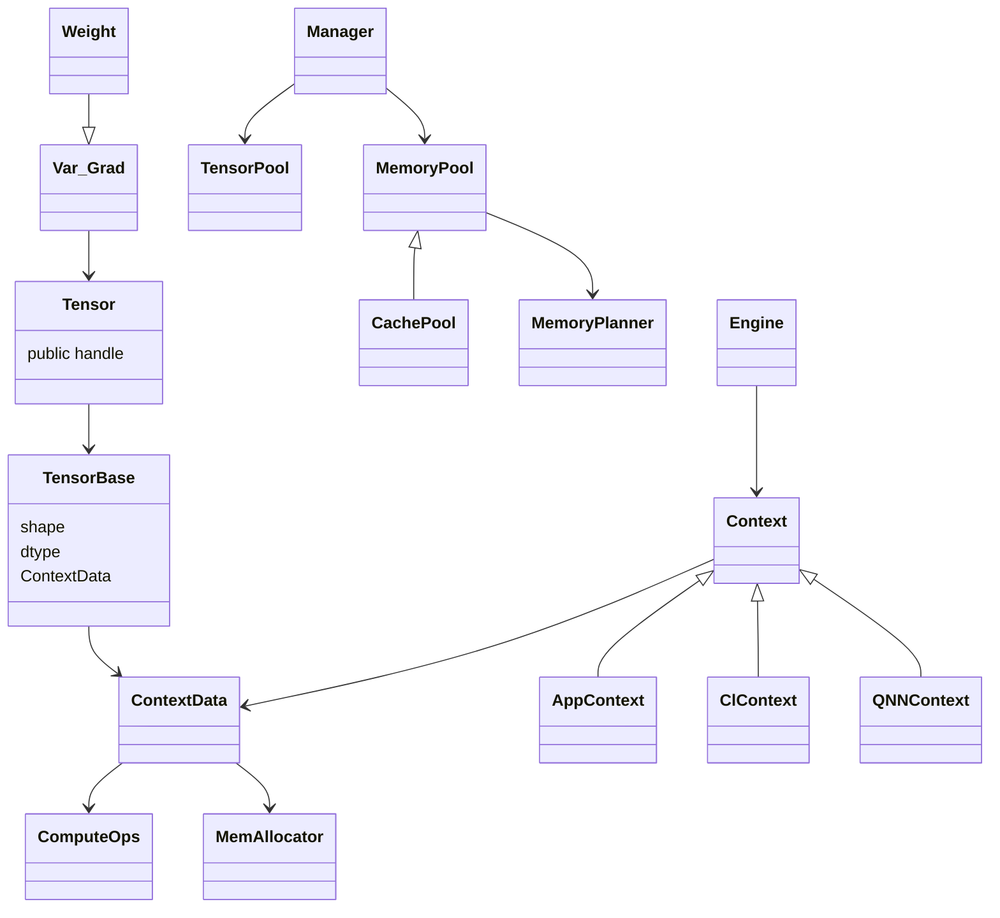
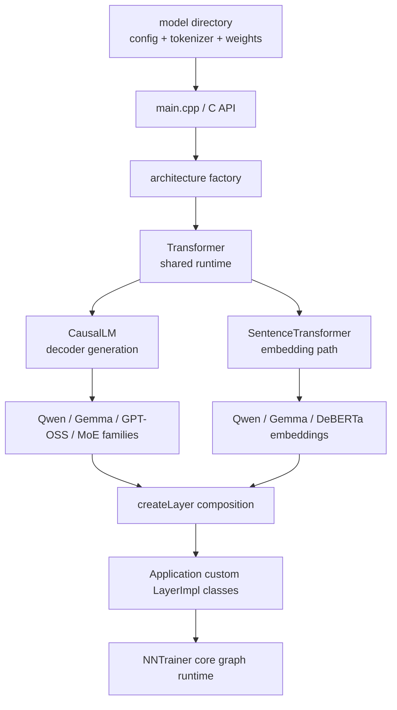

# L0 Visual System Map

> **Layer 0.** Start here when you need to understand the system shape before
> reading code. This page is intentionally diagram-heavy. It explains what
> exists, how the major pieces connect, and which core classes carry each
> responsibility.

---

## 1. One-sentence model

NNTrainer is a model execution runtime: public APIs and applications build a
model graph, the graph wraps concrete layers, layers request tensors and
weights, and tensor operations dispatch through a backend context to CPU,
OpenCL, or QNN.

---

## 2. System overview

The most important split is this:

- `NeuralNetwork` owns lifecycle.
- `NetworkGraph` owns execution structure.
- `LayerNode` connects graph semantics to concrete `Layer` instances.
- `Tensor`/`Manager` own storage and lifetime.
- `Engine`/`Context`/`ComputeOps` own backend dispatch.

---

## 3. Runtime lifecycle

This is why debugging usually starts from one of two questions:

1. Did graph construction produce the right `LayerNode` topology?
2. Did runtime tensors carry the right `ContextData` and dtype?

---

## 4. Core class relationships

Read this as ownership and call direction, not as a complete inheritance map.
The full declaration inventory is in
[`09-class-map-inventory.md`](09-class-map-inventory.md).

---

## 5. Tensor, memory, and backend dispatch

Backend selection is not scattered across tensor math. The backend identity is
carried by `ContextData` on `TensorBase`, and tensor operations route through
the `ComputeOps` table.

---

## 6. CausalLM as the main application stack

CausalLM is not a thin sample. It is an application-level model system that
uses the same core graph runtime, but it builds graphs from C++ model classes
instead of only from INI/ONNX/TFLite input files.

---

## 7. Navigation by task

| If you need to understand... | Start here | Then read |
|---|---|---|
| Whole system flow | This page | [`01-container-view.md`](01-container-view.md) |
| Core model lifecycle | `NeuralNetwork -> NetworkGraph` diagrams above | [`02-components/models.md`](02-components/models.md), [`02-components/graph.md`](02-components/graph.md) |
| Layer behavior | `LayerNode -> Layer -> Context` diagrams above | [`02-components/layers.md`](02-components/layers.md) |
| Tensor dtype / memory / dispatch | Tensor/backend diagram above | [`02-components/tensor.md`](02-components/tensor.md), [`02-components/backends.md`](02-components/backends.md) |
| CausalLM implementation | CausalLM diagram above | [`06-application-surface-causallm.md`](06-application-surface-causallm.md) |
| Exact class declaration | The owning diagram first | [`09-class-map.md`](09-class-map.md), [`09-class-map-inventory.md`](09-class-map-inventory.md) |
| Whether a source file was scanned | Generated coverage | [`09-source-file-coverage.md`](09-source-file-coverage.md) |

---

## 8. Mental checklist

Before opening code, identify:

1. Entry path: public API, CausalLM, test, or tool.
2. Graph source: parsed file, programmatic layer API, or C++ model builder.
3. Runtime owner: `NeuralNetwork` or application wrapper.
4. Execution graph: `NetworkGraph` and `LayerNode`.
5. Storage path: `Tensor`, `Weight`, `Manager`, and pools.
6. Backend path: `Engine`, `Context`, `ContextData`, and `ComputeOps`.

If those six are clear, the implementation files become much easier to search.
