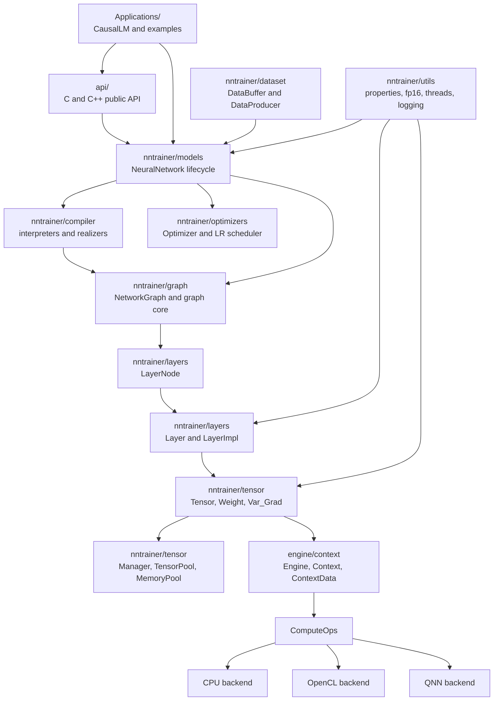
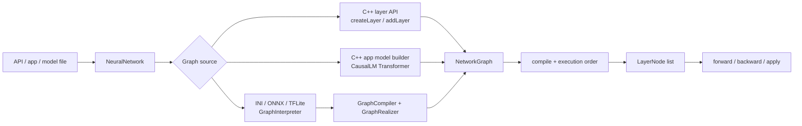
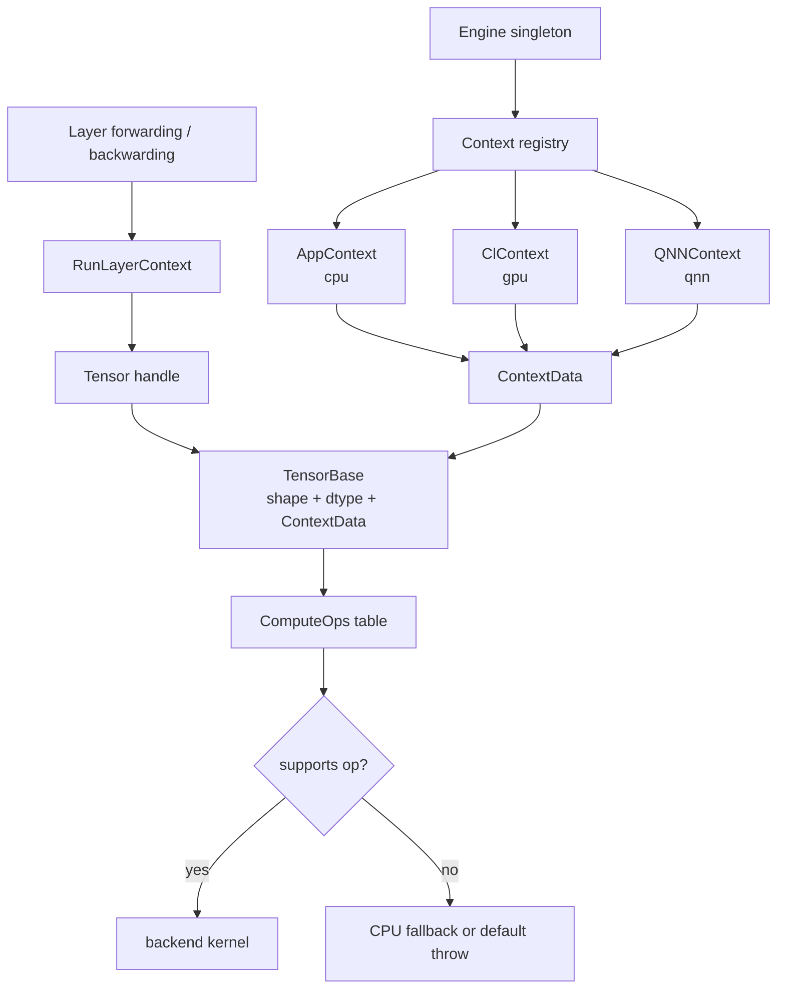
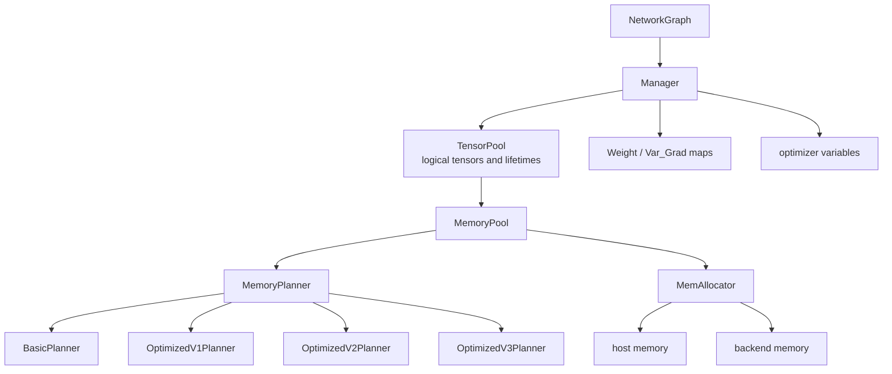

# L2 Container / Subsystem View

> **Layer 2.** This page zooms into the NNTrainer runtime and explains the
> major subsystems, their responsibilities, and the load-bearing flows between
> them. For the fastest human-readable overview, read
> [`00-visual-system-map.md`](00-visual-system-map.md) first.

---

## 1. Responsibility

Decompose `nntrainer/` into named subsystems with clear ownership boundaries.
The two flows that matter most are:

1. graph construction followed by training or inference,
2. tensor operation dispatch into CPU, OpenCL, or QNN backends.

---

## 2. Container map



Supporting subsystems:

- `schema/`: model serialization and file compatibility.
- `utils/`: properties, threading, fp16 helpers, INI wrappers, profiling, and
  logging helpers.
- `opencl/` and `qnn/`: device-specific plumbing used by backend contexts.
- `packaging/`, `tools/`, and platform folders: build, release, and integration
  surfaces rather than runtime owners.

---

## 3. Core graph concept

The central runtime idea is that NNTrainer separates model lifecycle from graph
execution.



Key classes:

- `NeuralNetwork`: top-level model lifecycle owner.
- `GraphInterpreter`: reads model descriptions.
- `GraphCompiler`: coordinates graph normalization.
- `GraphRealizer`: transforms graph nodes before execution.
- `NetworkGraph`: executable graph, node ordering, context stamping, and memory
  planning entry point.
- `LayerNode`: graph node wrapper around exactly one concrete `Layer`.
- `Layer` / `LayerImpl`: actual layer contract and implementation base.

Important correction: file formats are only one input path. Many application
models, especially `Applications/CausalLM/`, build graphs directly in C++ and
feed the same `NetworkGraph` runtime.

---

## 4. Build to train/infer flow

```mermaid
sequenceDiagram
  participant Caller as Caller
  participant NN as NeuralNetwork
  participant Compiler as Compiler / Builder
  participant Graph as NetworkGraph
  participant Manager as Manager
  participant Layer as LayerNode / Layer
  participant Opt as Optimizer
  participant Data as DataBuffer

  Caller->>NN: create or load model
  NN->>Compiler: interpret or build graph
  Compiler->>Graph: add LayerNode objects
  NN->>Graph: compile()
  Graph->>Layer: validate ports and finalize layer specs
  Graph->>Manager: request tensors, weights, gradients
  Graph->>Graph: finalizeContext()
  Graph->>Manager: plan and allocate memory
  Caller->>NN: train() or inference()
  Data-->>NN: training batches when training
  NN->>Graph: forwarding()
  Graph->>Layer: run forward in execution order
  NN->>Graph: backwarding() when training
  Graph->>Layer: run derivatives and gradients
  NN->>Opt: apply gradients when training
```

The compile phase creates the conditions for fast runtime execution:

- node ports are connected,
- output and input shapes are finalized,
- tensor and weight requests are registered,
- backend `ContextData` is stamped,
- memory planning is resolved.

By the time `forwarding()` runs, tensor ops should already know their backend
through `TensorBase::ct_data_`.

---

## 5. Tensor dispatch flow



Rules:

- Tensor call sites do not select vendors with broad `#ifdef` branches.
- `Engine` registers available `Context` implementations.
- `ContextData` carries backend state and `ComputeOps`.
- `TensorBase` stores `ContextData`.
- Unsupported accelerated operations must have an explicit fallback or fail
  fast.

---

## 6. Memory and tensor ownership



`NetworkGraph` decides what tensors exist. `Manager` decides how those tensors
are represented and allocated. `MemoryPlanner` decides reuse strategy.

---

## 7. Subsystems at a glance

| Subsystem | Key classes | Responsibility | Deep doc |
|---|---|---|---|
| `api/` | `ml::train::Model`, `Layer`, `Tensor`, `Optimizer`, C handles | Public user-facing facade. | [`09-class-map.md`](09-class-map.md) |
| `models/` | `NeuralNetwork`, `ModelLoader`, `DynamicTrainingOptimization` | Model lifecycle, compile/train/infer/save/load. | [`02-components/models.md`](02-components/models.md) |
| `compiler/` | `GraphCompiler`, `GraphInterpreter`, `GraphRealizer` | Convert descriptions into executable graph structure. | [`02-components/compiler.md`](02-components/compiler.md) |
| `graph/` | `NetworkGraph`, `GraphCore`, `GraphNode`, `Connection` | Graph topology, execution order, context stamping. | [`02-components/graph.md`](02-components/graph.md) |
| `layers/` | `LayerNode`, `Layer`, `LayerImpl`, concrete layers | Layer contract, properties, forward/backward logic. | [`02-components/layers.md`](02-components/layers.md) |
| `tensor/` | `Tensor`, `TensorBase`, `Manager`, `TensorPool`, typed tensors | Dtype, storage, lifetime, operations, quantization. | [`02-components/tensor.md`](02-components/tensor.md) |
| backends | `Engine`, `Context`, `ContextData`, `ComputeOps` | Backend factory and dispatch chain. | [`02-components/backends.md`](02-components/backends.md) |
| `optimizers/` | `Optimizer`, `OptimizerWrapped`, schedulers | Weight updates and learning-rate policy. | [`02-components/optimizers.md`](02-components/optimizers.md) |
| `dataset/` | `DataBuffer`, `DataProducer`, `IterationQueue` | Training data source and batching. | [`02-components/dataset.md`](02-components/dataset.md) |
| `Applications/CausalLM/` | `Transformer`, `CausalLM`, model families, custom layers | Main application-level model stack. | [`06-application-surface-causallm.md`](06-application-surface-causallm.md) |

---

## 8. Container-level invariants

- **INV-CONT-1: Single dispatch path.** Tensor ops reach a backend through
  `Engine -> Context -> ContextData -> ComputeOps`.
- **INV-CONT-2: Compile-time context stamping.** A tensor's backend is decided
  during graph initialization/finalization and carried as `TensorBase::ct_data_`.
- **INV-CONT-3: Layered dependencies.** Dependencies point downward:
  `models -> graph/layers/optimizers/dataset -> tensor -> backend dispatch`.
- **INV-CONT-4: CPU compatibility fallback.** Tensors without attached context
  continue to use the global CPU path.
- **INV-CONT-5: Applications build graphs too.** INI/ONNX/TFLite are not the
  only entry points; C++ builders must still respect the same graph/runtime
  contracts.

---

## 9. Human review triggers

Update this document when a change does any of the following:

- adds or removes a major runtime subsystem,
- moves ownership between `models`, `graph`, `layers`, `tensor`, or backend
  context code,
- changes the `NeuralNetwork -> NetworkGraph -> LayerNode -> Tensor` path,
- changes when or where `ContextData` is attached,
- adds a backend or changes backend fallback behavior,
- turns an application-specific graph builder into a shared runtime path.
