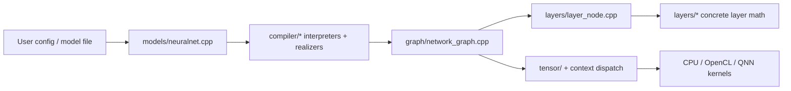

# L2 — Container / Subsystem View

> **Layer 2 (Containers).** Zooms into the NNTrainer box from L1 and shows the
> major subsystems, their responsibilities, how data and control flow between
> them, and the **dispatch backbone** that lets tensor ops reach the right
> backend without `#ifdef` at the call site. Changes here are subsystem-level and
> warrant human architecture review.

---

## Responsibility

Decompose `nntrainer/` into named subsystems with clear ownership boundaries, and
make the two load-bearing flows explicit: **(A) build-then-train/infer** and
**(B) tensor-op dispatch**.

---

## Subsystem map

```
                         ┌───────────────────────────────────────────┐
                         │                  models/                    │
                         │  NeuralNetwork: build → train/infer loop    │
                         └───────────────┬─────────────────────────────┘
                                         │ uses
        ┌────────────────┬──────────────┼───────────────┬─────────────────┐
        ▼                ▼              ▼               ▼                 ▼
 ┌────────────┐  ┌──────────────┐  ┌─────────┐   ┌────────────┐   ┌────────────┐
 │ compiler/  │  │   graph/     │  │ layers/ │   │optimizers/ │   │  dataset/  │
 │ INI/ONNX/  │─▶│ NetworkGraph │◀▶│ Layer + │   │ SGD/Adam + │   │ producers/ │
 │ TFLite →   │  │ exec order,  │  │LayerNode│   │ LR sched   │   │ loaders    │
 │ realize    │  │ finalize ctx │  │         │   │            │   │            │
 └────────────┘  └──────┬───────┘  └────┬────┘   └─────┬──────┘   └─────┬──────┘
                        │ allocates &    │ forward/      │ apply         │ feeds
                        │ stamps ctx     │ backward      │ gradients     │ batches
                        ▼                ▼               ▼               ▼
                 ┌──────────────────────────────────────────────────────────────┐
                 │                          tensor/                              │
                 │   Tensor (Pimpl) → TensorBase → ComputeOps* → kernels         │
                 └───────────────────────────────┬──────────────────────────────┘
                                                 │ dispatch (see flow B)
                                                 ▼
                 ┌──────────────────────────────────────────────────────────────┐
                 │   Engine / Context / ContextData  (dispatch backbone)         │
                 │   app_context (cpu) · cl_context (gpu) · qnn_context (npu)     │
                 └──────────────────────────────────────────────────────────────┘
```

Supporting subsystems (used by all of the above): `schema/` (serialization),
`utils/` (properties, threading, fp16, INI wrapper), `opencl/` & `qnn/` (device
plumbing), root logging/error (`nntrainer_log.h`, `nntrainer_error.h`).

---

## Core graph concept

The most important runtime idea in NNTrainer is the split between **model
orchestration** and **graph execution**:

- `models/neuralnet.cpp` owns the public model lifecycle and is the outer
  orchestration object.
- `compiler/*` turns user input formats such as INI/ONNX/TFLite into a graph
  representation.
- `graph/network_graph.cpp` owns the executable graph, compilation, ordering,
  context stamping, allocation, and the train/infer execution loops.
- `layers/layer_node.cpp` wraps each concrete `Layer` in a graph node so the
  graph can connect ports, allocate tensors, and call forward/backward on each
  layer in order.



What this means in practice:

1. `NeuralNetwork` is the public API surface that a caller interacts with.
2. The compiler produces a `NetworkGraph` made of `LayerNode` objects.
3. `NetworkGraph::compile()` and `NetworkGraph::initialize()` transform that
   graph into executable order and stamp backend context onto tensors.
4. Runtime execution is then just ordered `LayerNode` calls backed by tensors
   and dispatchable compute ops.
5. If you want to understand any training or inference bug, start by tracing
   one path through `NeuralNetwork -> NetworkGraph -> LayerNode -> Tensor ->
   Context`.

Important correction: the compiler path is only one of the entry points.
Many application stacks, especially `Applications/CausalLM/`, construct model
graphs through C++ model classes instead of starting from INI/ONNX/TFLite.
That means the architecture story is not "file format first"; it is "runtime
graph first", with file formats and C++ builders both feeding the same graph
and execution layers.

---

## Subsystems at a glance

| Subsystem | Responsibility | L3 doc |
|---|---|---|
| `models/` | Top-level `NeuralNetwork`; owns the build → compile → train/infer lifecycle. | [models](02-components/models.md) |
| `compiler/` | Turn a model description (INI/ONNX/TFLite) into a graph via interpreters + realization passes. | [compiler](02-components/compiler.md) |
| `graph/` | `NetworkGraph`: node ordering, execution order, `finalizeContext()` (stamps ContextData onto tensors). | [graph](02-components/graph.md) |
| `layers/` | Layer implementations + `LayerNode`; forward/backward, weights, properties. | [layers](02-components/layers.md) |
| `optimizers/` | Optimizer algorithms + learning-rate schedulers. | [optimizers](02-components/optimizers.md) |
| `dataset/` | Data producers/loaders feeding training batches. | [dataset](02-components/dataset.md) |
| `tensor/` | Tensor abstraction, ops, pools/planners, quantization, CPU/GPU kernels. | [tensor](02-components/tensor.md) |
| **Dispatch backbone** | `Engine`/`Context`/`ContextData`/`ComputeOps` — routes ops to CPU/GPU/NPU. | [backends](02-components/backends.md) + [dispatch](03-crosscutting/dispatch-and-backends.md) |

---

## Flow A — build then train/infer

```
INI/ONNX/TFLite  ──compiler──▶  NetworkGraph  ──finalizeContext()──▶  tensors carry ContextData
        │                                                                      │
        └──────────────────────────── models::NeuralNetwork ───────────────────┘
                         │ epoch loop:
                         │   dataset → forward(layers) → loss → backward → optimizer.apply
                         ▼
                    trained weights ──schema──▶ saved model
```

Key contract: **ContextData is attached to tensors at compile time**
(`network_graph.cpp::finalizeContext()`), not at op time. By the time the train
loop runs, every tensor already knows its backend.

---

## Flow B — tensor-op dispatch (the backbone)

```
Engine (singleton, process-wide)
  │  ensureComputeOps() once at startup  → binds global CPU g_compute_ops
  │  registry of Context by name: "cpu" | "gpu" | "qnn"
  └─▶ Context (per vendor; user-facing entry)
        └─▶ ContextData (per-vendor state; lives on TensorBase as shared_ptr)
              └─▶ ComputeOps*  (abstract; ~80 virtual kernel methods)
                    └─▶ kernels (NEON / AVX / OpenCL / QNN inside the override)
```

This backbone is summarized here and specified in full in
[`03-crosscutting/dispatch-and-backends.md`](03-crosscutting/dispatch-and-backends.md)
and `docs/backend_guide/ARCHITECTURE.md`.

---

## Container-level invariants

- **INV-CONT-1 — Single dispatch path.** Tensor ops reach a backend only through
  the `Engine → Context → ContextData → ComputeOps` chain. No `#ifdef <vendor>`
  at a tensor call site.
- **INV-CONT-2 — Compile-time context stamping.** A tensor's backend is decided
  in `finalizeContext()` and carried as `TensorBase::ct_data_`; ops do not pick a
  backend ad hoc.
- **INV-CONT-3 — Layered dependencies.** Dependencies point *downward*:
  `models → {compiler, graph, layers, optimizers, dataset} → tensor → backbone`.
  A new upward edge (e.g. `tensor/` depending on `layers/`) is an architecture
  smell and requires review.
- **INV-CONT-4 — Backward-compatible fallback.** A tensor with no ContextData
  falls through to the global CPU `g_compute_ops`. Existing code keeps working.

---

## What changes at this layer (triggers human architecture review)

- A new subsystem directory under `nntrainer/`, or moving responsibility between
  subsystems.
- A new dependency edge between subsystems (especially an upward one).
- A change to the dispatch backbone's shape (new tier, new Context kind).
- A change to *when/where* ContextData is stamped.

Each of these should update this document **and** the affected L3/L4 doc in the
same PR, and carry an [ADR](adr/) if it changes a documented invariant.
