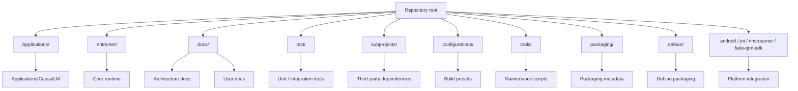

# L5 Repository Map

> **Layer 5.** This is the project-wide map: what lives at the repository root,
> where to start for each major surface, and how the pieces relate before you
> open code. Use it as the first stop when you need to orient a new agent or a
> new contributor.

---

## 1. Big picture



This tree is organized around two distinct axes:

1. The **core library path**: `nntrainer/` is the runtime engine, tensor system,
   backends, and layer implementations.
2. The **application path**: `Applications/CausalLM/` is a full product surface
   on top of the core library, with its own CLI, API, C++ model hierarchy,
   custom layers, and shipped resources. This is the most important application
   tree in the repository and should usually be read before the smaller example
   apps.

The documentation in `docs/architecture/` describes the core library in the
same layered way as the runtime itself. This file bridges that core map to the
rest of the repository.

---

## 2. Top-level folder map

| Folder | Role | First file to read | Notes |
|---|---|---|---|
| `nntrainer/` | Core library runtime and model execution stack | [`docs/architecture/00-visual-system-map.md`](00-visual-system-map.md) | Start with the visual map, then read the container and component docs. |
| `Applications/CausalLM/` | Standalone CausalLM application and C API | [`Applications/CausalLM/README.md`](../../Applications/CausalLM/README.md) | Separate product surface that uses the core runtime. |
| `docs/` | User docs, architecture docs, backend guide, images | [`docs/architecture/README.md`](README.md) | Architecture docs live here; backend guide remains the implementation reference for backend authors. |
| `test/` | Unit and integration tests | `test/unittest/` | Tests are the enforcement layer for the architecture contracts. |
| `subprojects/` | Third-party and vendored build dependencies | `subprojects/README` if present, otherwise build scripts | Includes OpenBLAS, googletest, tokenizers dependencies, and other external build inputs. |
| `configurations/` | Meson/native build presets | `configurations/windows-native.ini` | Build host presets and platform-specific defaults. |
| `tools/` | Maintenance and automation scripts | `tools/` scripts used by CI or repo maintenance | Helper scripts, codegen, and local utilities. |
| `packaging/` | Packaging metadata | `packaging/` | Tizen and distro packaging inputs. |
| `debian/` | Debian packaging | `debian/` | Distribution packaging for Debian-based targets. |
| `jni/` | Android JNI integration for CausalLM | `Applications/CausalLM/jni/Android.mk` | Android-facing integration for the application surface. |
| `nnstreamer/` | NNStreamer integration code | `docs/components.md` and `docs/backend_guide/ARCHITECTURE.md` | Integration surface for media pipeline users. |
| `fake-qnn-sdk/` | Build-time QNN stub | `docs/backend_guide/QNN_BUILD.md` | Lets builds proceed when the real SDK is unavailable. |

---

## 3. Core library map

The `nntrainer/` directory is the engine room. The layered documentation under
`docs/architecture/02-components/` already covers the internal anatomy in detail.

```text
nntrainer/
  engine + context + *_context
  tensor/
  layers/
  graph/
  compiler/
  models/
  optimizers/
  dataset/
  utils/
  schema/
```

The load-bearing relationships are:

- `models/` sits at the top of the runtime stack and orchestrates compile,
  train, and infer.
- `compiler/` translates model descriptions into a graph and realization plan.
- `graph/` owns execution order and context stamping.
- `layers/` implements layer behavior and forwards to the tensor stack.
- `tensor/` owns tensor representation, memory planning, quantization, and op
  dispatch hooks.
- `engine` and `*_context` form the dispatch backbone that routes tensor ops to
  CPU, OpenCL, or QNN.

Read the visual and component docs for the exact contracts:

- [`00-visual-system-map.md`](00-visual-system-map.md)
- [`01-container-view.md`](01-container-view.md)
- [`02-components/models.md`](02-components/models.md)
- [`02-components/compiler.md`](02-components/compiler.md)
- [`02-components/graph.md`](02-components/graph.md)
- [`02-components/layers.md`](02-components/layers.md)
- [`02-components/tensor.md`](02-components/tensor.md)
- [`02-components/backends.md`](02-components/backends.md)
- [`09-class-map.md`](09-class-map.md) for class ownership and relationships.
- [`09-class-map-inventory.md`](09-class-map-inventory.md) for the generated
  file-level declaration index.
- [`09-source-file-coverage.md`](09-source-file-coverage.md) for the generated
  maintained source file coverage list, including files without class-like
  declarations.

---

## 4. Application surface map

### 4.1 `Applications/CausalLM/`

This folder is a separate application stack built on top of the core runtime.
It is not a thin example. It has its own execution model, model-family
registrations, custom layers, model resources, tokenizer integration, and build
scripts.

```text
Applications/CausalLM/
  main.cpp                  CLI entry point
  api/                      C API wrapper and model config registry
  models/                   Shared Transformer/CausalLM runtime and model families
  layers/                   Custom layers used by application models
  res/                      Shipped model assets and conversion scripts
  third_party/minja/        Chat-template renderer
  jni/                      Android packaging
  tokenizers_c_win/         Windows tokenizer build helper
  build_*.sh / .ps1         Platform-specific build helpers
```

The major runtime path is:

```mermaid
flowchart TD
  A[main.cpp] --> B[Load config JSON]
  B --> C[Factory / architecture selection]
  C --> D[Construct Transformer or CausalLM subclass]
  D --> E[initialize()]
  E --> F[load_weight()]
  F --> G[run() / inference loop]
  G --> H[chat template + tokenizer]
  H --> I[model-specific layers and tensor ops]
```

Important internal roles:

- `main.cpp` is the CLI entry point.
- `factory.h` and the model registration code decide which concrete class is
  instantiated for a given `architecture`.
- `models/transformer.*` is the shared base runtime: tokenizer setup, weight
  loading, model graph construction, `initialize()`, and prompt execution
  scaffolding.
- `models/causal_lm.*` is the decoder-only specialization: LM head, KV cache,
  sampling, output decoding, and token-generation loop.
- `models/sentence_transformer.*` is the embedding-style branch for sentence
  vector workloads.
- `models/<family>/` contains the architecture-specific implementations.
  These are usually the code paths you want for "how does model X actually
  work?" questions.
- `models/README.md` is the index for the model hierarchy and should point you
  to the right family folder before you read the code.
- `api/` exposes the same runtime through a C ABI and config helpers.
- `layers/` contains application-specific custom layers and fused building
  blocks used by the model families.
- `res/` packages model weights, configs, and conversion scripts that produce
  the runtime binaries.
- `third_party/minja/` renders chat templates without a Python dependency.
- `build_*.sh` and `build_*.ps1` are platform entry points, not architecture
  sources, but they matter for understanding how the app is assembled.

The detailed application surface has its own README, but this folder is the
main place to look when you need to understand how CausalLM is assembled from
the core library.

### 4.2 `docs/`

`docs/architecture/` is the high-level map. `docs/backend_guide/` remains the
deep implementation reference for backend authors. The rest of `docs/` is user
documentation, setup guides, and reference material.

### 4.3 `test/`

Tests are the enforcement layer. If architecture changes alter behavior, the
matching tests should move with the code and the docs.

---

## 5. How to use this map

- Start here when you do not know which folder owns the change.
- Use the root folder map to decide whether the change belongs in `nntrainer/`,
  `Applications/CausalLM/`, or a build/documentation folder.
- Then jump to the existing layer docs under `docs/architecture/` for the core
  runtime, or to the application README for the CausalLM surface.
- If a change crosses boundaries, update the relevant architecture docs in the
  same PR.

---

## 6. Review focus

- New contributors should use this page as the folder index before reading
  code.
- Reviewers should use it to confirm that a change touches the expected part of
  the repository.
- Agents should use it to narrow search scope before opening implementation
  files.
