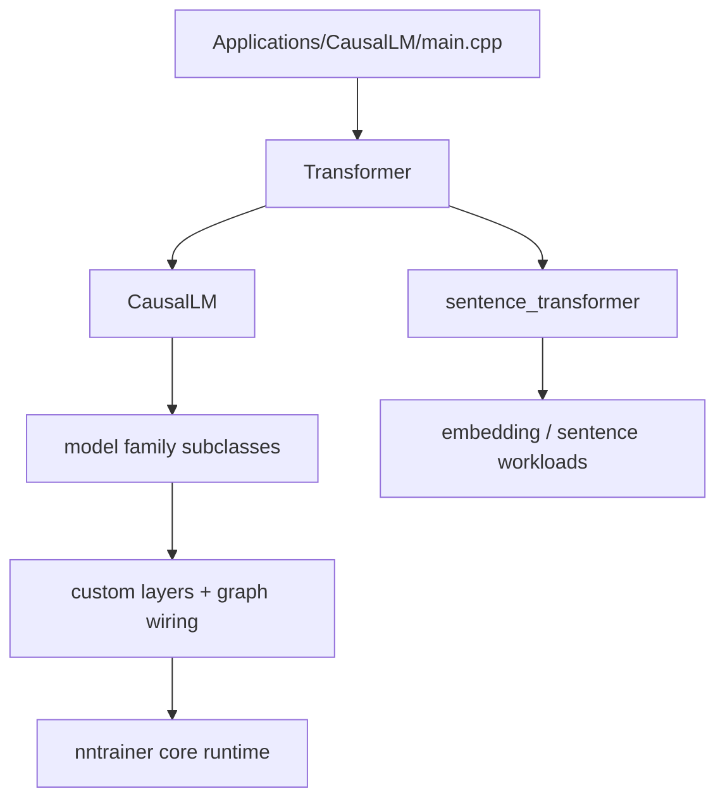
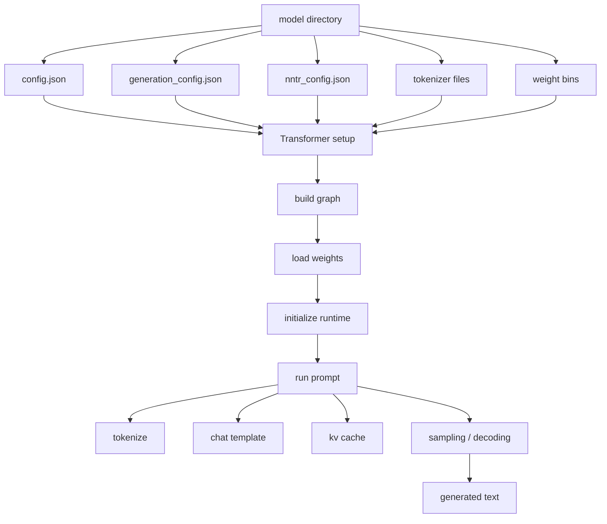

# L6 CausalLM Application Surface

> **Layer 6.** This page documents the most important application tree in the
> repository: `Applications/CausalLM/`. It is not a toy example. It is a full
> application stack with its own runtime hierarchy, model families, custom
> layers, resource conversion path, tokenizer integration, and platform build
> entry points.

---

## 1. Responsibility

Explain how the CausalLM application is assembled from the core `nntrainer`
library, where the important C++ model classes live, and how the model families
connect to each other.

This page answers questions like:

- What is the shared runtime?
- Which class owns prompt execution?
- Which class owns decoder-only generation?
- Where do the model families live?
- Where do the custom layers live?
- How are model resources converted and shipped?

---

## 2. CausalLM hierarchy



The implementation is centered around a C++ inheritance hierarchy:

1. `Transformer` is the shared base runtime.
2. `CausalLM` extends `Transformer` for decoder-only generation.
3. Model-family classes inherit from those bases and wire the actual
   architecture.
4. The application then uses the core nntrainer runtime to execute the graph.

---

## 3. Runtime layers

### 3.1 `transformer.*`

`Applications/CausalLM/models/transformer.h` and `transformer.cpp` define the
shared runtime foundation.

Responsibilities:

- parse model and generation config,
- load tokenizers,
- register custom layers,
- build the symbolic model graph,
- initialize and load weights,
- run prompt-to-output inference,
- expose metrics and model state.

Important design point:

- `Transformer` is not tied to one model family.
- It owns the common "model lifecycle" behavior.
- Derived classes customize only what they need: graph construction, layer
  wiring, and model-specific configuration.

### 3.2 `causal_lm.*`

`Applications/CausalLM/models/causal_lm.h` and `causal_lm.cpp` specialize the
shared runtime for decoder-only generation.

Responsibilities:

- construct the final LM-head stage,
- manage KV cache allocation and binding,
- generate tokens from logits,
- apply sampling and bad-word filtering,
- preserve generation state across iterations,
- expose the final generated text.

This is the main runtime class for the large language model path.

### 3.3 `models/<family>/`

Each family directory holds the architecture-specific implementation.

Typical examples:

- `qwen2/`
- `qwen3/`
- `qwen3_moe/`
- `qwen3_slim_moe/`
- `qwen3_cached_slim_moe/`
- `gpt_oss/`
- `gpt_oss_cached_slim/`
- `gemma3/`
- `timm_vit/`
- `deberta_v2/`

What these families usually provide:

- family-specific subclass of `Transformer` or `CausalLM`,
- family-specific graph assembly,
- custom attention/FFN/embedding wiring,
- custom layers when the core runtime does not already have the needed op,
- family-specific model config defaults and loading behavior.

### 3.4 `layers/`

The `layers/` directory contains the application-only layers that the model
families depend on.

Examples of responsibilities:

- attention helper layers,
- fused RMSNorm / MLP / embedding helpers,
- LM head helpers,
- pooling or projection layers used by specific model families,
- MoE-specific utility layers.

These are not generic nntrainer core layers. They are application-level
building blocks that support the CausalLM family tree.

### 3.5 `res/`

`res/` is the shipped model surface.

It contains:

- model configs,
- tokenizer files,
- generation configs,
- weight conversion scripts,
- model-specific README files,
- binaries created by the conversion scripts.

This directory is part of the runtime contract because the code assumes the
packaged files exist with the right names and layout.

---

## 4. CausalLM execution path



The important sequence is:

1. Load configs and tokenizer metadata.
2. Select the concrete model family class.
3. Build the symbolic graph through `Transformer` / `CausalLM`.
4. Load weights and bind custom layers.
5. Run inference and decode output tokens.

---

## 5. Key class relationships

```text
Transformer
  -> shared runtime, config, tokenizer, graph construction

CausalLM : Transformer
  -> decoder-only generation, KV cache, output decoding

<family> : CausalLM or Transformer
  -> architecture-specific graph and layer wiring

layers/*
  -> custom ops used by the families

main.cpp
  -> selects the concrete class and starts execution
```

The important thing to understand is that most of the interesting model logic
is not in the core library. It is implemented in the CausalLM model hierarchy.
The core library provides the execution engine; this application tree decides
what graph to execute.

---

## 6. Files that matter first

| File / folder | Why it matters |
|---|---|
| `main.cpp` | CLI entry point and config selection. |
| `models/transformer.*` | Shared runtime and graph assembly foundation. |
| `models/causal_lm.*` | Decoder-only generation and token loop. |
| `models/README.md` | Family index and model taxonomy. |
| `models/<family>/` | The actual implementation for each supported model family. |
| `layers/` | Application-specific layer implementations. |
| `res/` | Shipped model assets and conversion scripts. |
| `api/` | C API surface for embedding the runtime elsewhere. |
| `third_party/minja/` | Chat template engine used at runtime. |
| [`07-causallm-model-index.md`](07-causallm-model-index.md) | Model-family map and platform split. |
| [`08-causallm-resources.md`](08-causallm-resources.md) | Resource tree, weight formats, and conversion scripts. |

---

## 7. Supported model families

The application supports multiple model families through factory registration.
The important thing is not only the model names, but also the implementation
pattern each family uses.

### 7.1 Decoder-only causal models

- `LlamaForCausalLM` -> `CausalLM`
- `Qwen2ForCausalLM` -> `Qwen2CausalLM`
- `Qwen3ForCausalLM` -> `Qwen3CausalLM`
- `Qwen3MoeForCausalLM` -> `Qwen3MoECausalLM`
- `Qwen3SlimMoeForCausalLM` -> `Qwen3SlimMoECausalLM`
- `Qwen3CachedSlimMoeForCausalLM` -> `Qwen3CachedSlimMoECausalLM`
- `GptOssForCausalLM` -> `GptOssForCausalLM`
- `GptOssCachedSlimCausalLM` -> `GptOssCachedSlimCausalLM`
- `Gemma3ForCausalLM` -> `Gemma3CausalLM`

### 7.2 Embedding and encoder-style models

- `Qwen2Embedding` -> `Qwen2Embedding`
- `Qwen3Embedding` -> `Qwen3Embedding`
- `EmbeddingGemma` -> `EmbeddingGemma`
- `DebertaV2` -> `DebertaV2`
- `MultilingualTinyBert` -> `MultilingualTinyBert`
- `TimmViT` -> `TimmViTTransformer`
- `SentenceTransformer`-style model paths are handled by `sentence_transformer.*`

### 7.3 Platform differences

The model list is not identical across platforms.

- Windows excludes some cached-slim and BERT-family variants.
- Android follows the same overall family graph as non-Windows, but the build
  system still applies platform guards in the entry points.
- The exact buildable set is documented in [`07-causallm-model-index.md`](07-causallm-model-index.md).

---

## 8. Implementation patterns

This section is the part that matters when you need to understand how a model
is actually built. The code does not define models as one monolithic block.
It composes them from reusable nntrainer layers through `createLayer()`.

### 8.1 Shared construction pattern

Most model classes follow the same shape:

1. `setupParameters()` reads config and fills derived dimensions or flags.
2. `registerCustomLayers()` registers application-only layer factories.
3. `constructModel()` builds the symbolic graph.
4. `createAttention()` and `createMlp()` are overridden where the family needs
   a different block shape.
5. `run()` in the runtime class drives tokenization, cache binding, and
   decoding.

The key point is that `createLayer()` is the assembly primitive. A family
class does not handcraft a tensor engine. It instantiates named layer objects,
feeds tensors between them, and lets nntrainer compile the resulting graph.

### 8.2 Base transformer graph

`Transformer::constructModel()` defines the shared skeleton:

- input tensor creation,
- token embedding or shared embedding,
- repeated decoder block construction,
- final RMSNorm,
- return of graph endpoints.

`Transformer::createTransformerDecoderBlock()` is the template for one block:

1. attention norm
2. `createAttention()`
3. residual addition
4. FFN norm
5. `createMlp()`
6. final residual addition

This is the common contract that all decoder-style model families inherit.

### 8.3 Attention pattern

The default attention path is assembled from the following pieces:

- `fully_connected` for `wq`
- `fully_connected` for `wk`
- `fully_connected` for `wv`
- `mha_core` for the attention core
- `fully_connected` for `wo`

The family override changes the pre-processing around the attention core, not
the fact that attention is built from named sublayers.

Examples:

- `Qwen3Transformer` adds `reshaped_rms_norm` on the query and key branches
  before `mha_core`.
- `Gemma3Transformer` adds query/key normalization and uses family-specific
  `mha_core` settings such as sliding-window and position limits.
- `BertTransformer` and `DebertaV2` use their own attention wiring but still
  assemble the graph by composing `createLayer()` calls.

### 8.4 MLP pattern

The default feed-forward path is:

- `fully_connected` for up projection,
- `fully_connected` for gate projection,
- `swiglu`,
- `fully_connected` for down projection.

Families override this when the architecture needs a different block:

- `Qwen3MoE` and `GptOss` use the custom `qwen_moe` layer for MoE routing.
- `Gemma3Transformer` uses a gated MLP with `gelu` and `multiply`.
- Vision and encoder-style models often replace the causal MLP contract with
  their own per-block projection stack.

### 8.5 Custom layer registration

Model code registers application-only layers at runtime through the app
context:

- `SwiGLULayer`
- `RMSNormLayer`
- `MHACoreLayer`
- `TieWordEmbedding`
- `EmbeddingLayer`
- `LmHeadLayer`
- `ReshapedRMSNormLayer`
- `MoELayer`

This registration step matters because the graph builder refers to these
layers by string name. The factory registration makes those names resolvable
when the model graph is constructed.

### 8.6 Family-specific examples

- `Qwen3*` families share the same base attention contract and extend it with
  query/key reshaping and cache-aware attention.
- `Qwen3Moe*` families replace the FFN branch with MoE routing.
- `GptOss*` families follow the same pattern as Qwen3 but use their own
  MoE-specific wiring.
- `Gemma3*` families add q/k norm stages and a gated MLP variant.
- `DebertaV2` and `MultilingualTinyBert` are encoder-style paths and should be
  read as model-specific graph builders rather than simple decoder clones.
- `TimmViT` is the clearest non-text example: it builds patch embedding,
  attention blocks, and projection heads from the same `createLayer()` pattern.

### 8.7 What to read in code when debugging a model

1. `models/transformer.cpp` for the shared skeleton.
2. The relevant family file for attention or MLP overrides.
3. `models/causal_lm.cpp` for LM-head and generation behavior.
4. `layers/` for custom ops used by the family.
5. `main.cpp` and `api/causal_lm_api.cpp` for registration and entry-point
   behavior.

---
- Windows builds intentionally exclude some model variants that are only wired
  in on non-Windows platforms, such as certain cached-slim variants and BERT
  family paths in `meson.build`.
- The important documentation rule is to treat the supported list as a build
  matrix, not just a code list. If a model is compiled out on one platform, the
  docs should say so.

---

## 8. Weight file system

The application uses a structured on-disk model directory. The runtime assumes
the files exist and the names match the config.

### 8.1 Core files

- `config.json`
- `generation_config.json`
- `nntr_config.json`
- `tokenizer.json`
- `tokenizer_config.json`
- `special_tokens_map.json`
- model weight file(s) named by `nntr_config.json["model_file_name"]`

### 8.2 Runtime weight formats

`Transformer::formatFromExtension()` uses the file extension to choose how to
load the model:

- `.safetensors` -> `MODEL_FORMAT_SAFETENSORS`
- everything else -> `MODEL_FORMAT_BIN`

That means the runtime supports both safetensors input and nntrainer binary
weights, but the shipped application layout is generally organized around
pre-converted `.bin` files.

### 8.3 Conversion path

The `res/` tree contains the conversion scripts that produce the runtime
artifacts:

- `weight_converter.py`
- `convert_vision_hf.py`
- `convert_lm.py`
- `convert_connector.py`
- `convert_embedding.py`
- `gguf_to_nntrainer.py`

The conversion output is a directory containing the config files and one or
more `.bin` files with the names expected by `nntr_config.json`.

### 8.4 Directory layout pattern

The common pattern is:

```text
Applications/CausalLM/res/<family>/<model-name>/
  config.json
  generation_config.json
  nntr_config.json
  tokenizer.json
  tokenizer_config.json
  special_tokens_map.json
  <weight bin>
```

Some model families add their own helper scripts or extra resources beside this
baseline.

---

## 9. Tensor types and dtype policy

The application has to coordinate three different dtype layers:

1. the model tensor type,
2. the weight dtype,
3. the per-layer runtime tensor dtype.

### 9.1 Model tensor type

The model-level tensor type comes from `nntr_config.json["model_tensor_type"]`.
Examples seen in the codebase include:

- `FP32-FP32`
- `Q4_0-FP32`

This string encodes the weight dtype and activation dtype together.

### 9.2 Supported weight dtypes

The application and core tensor system support these important weight formats:

- `FP32`
- `FP16`
- `Q4_0`
- `Q6_K`
- `Q4_K`

The CausalLM application also uses `UINT16` and `FP16` for certain cache paths
and internal tensor storage.

### 9.3 CausalLM-specific layer dtype rules

- `embedding_layer.cpp` explicitly supports `FP32`, `Q4_0`, and `Q6_K`.
- `tie_word_embedding.cpp` follows the same quantized/FP32 pattern.
- `mha_core.cpp` and `deberta_attention_layer.cpp` select different cache and
  scratch layouts depending on `FP32`, `FP16`, or packed cache types.
- `kv_cache_manager.*` defaults to `FP16` cache storage unless the model path
  overrides it.

### 9.4 Runtime tensor types in the core library

The underlying `nntrainer/tensor/` code supports a larger set of tensor data
types, including:

- `FP32`
- `FP16`
- `UINT8`
- `UINT16`
- `QINT4`
- `QINT8`
- `QINT16`
- `Q4_0`
- `Q4_K`
- `Q6_K`

Not every dtype is valid for every layer or backend. The important rule is that
the document should separate "supported in the tensor system" from "used by the
CausalLM application path."

---

## 10. Acceleration structure

The application itself does not own the low-level kernels. It sits on top of the
nntrainer dispatch structure.

### 10.1 Default path

- CPU is the default path.
- The core runtime uses the `Engine -> Context -> ContextData -> ComputeOps`
  dispatch chain.
- On CPU, the implementation reaches NEON on ARM and AVX on x86 through the
  tensor backend code.

### 10.2 Optional accelerators

- OpenCL is available through the core backend stack.
- QNN is available through the plugin/backend plumbing.
- CausalLM-specific layers still need to respect the same dispatch and tensor
  compatibility rules as the core runtime.

### 10.3 What the application adds

- `mha_core` provides the attention path used by the large language models.
- `deberta_attention_layer` handles the special DeBERTa relative-attention
  behavior.
- `qwen3_*_moe` and `gpt_oss_*` add model-specific expert-routing and MoE
  behavior.
- `timm_vit` and `embedding_*` provide non-decoder paths that still run through
  the same model assembly and tensor dispatch system.

---

## 11. Where the model tree splits

The main split is not file format. It is implementation shape:

- `Transformer` for shared graph construction and prompt execution.
- `CausalLM` for decoder-only generation.
- `EmbeddingGemma`, `Qwen2Embedding`, `Qwen3Embedding`, `DebertaV2`,
  `MultilingualTinyBert`, and `TimmViTTransformer` for non-decoder paths.
- `Qwen3Moe` and `GptOss` families for MoE / expert-loading behavior.

That split should be visible in the docs before anyone opens code.

---

## 12. Change checklist

- If you add a new model family, document where it sits in the hierarchy.
- If you change `Transformer` or `CausalLM`, update the runtime flow here.
- If you add or rename application layers, update the layer map.
- If you change the shipped resource layout, update the `res/` description.
- If you add a new dtype or change a weight format, document the runtime path
  and the on-disk format together.
- If a model is compiled out on a platform, say so explicitly.

---

## 13. Review focus

- Prefer reading this page before opening family code.
- This page should tell a reviewer where a change belongs.
- When a new model family is added, the family folder should be obvious from
  this map.
