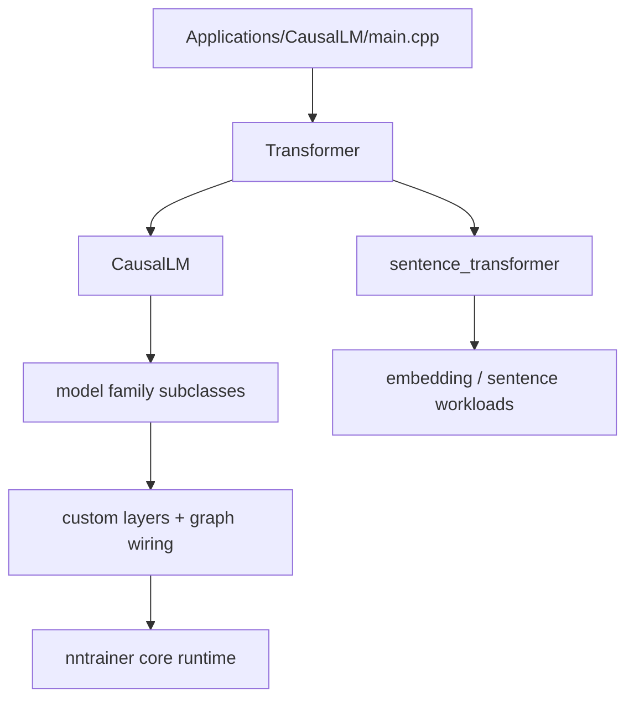
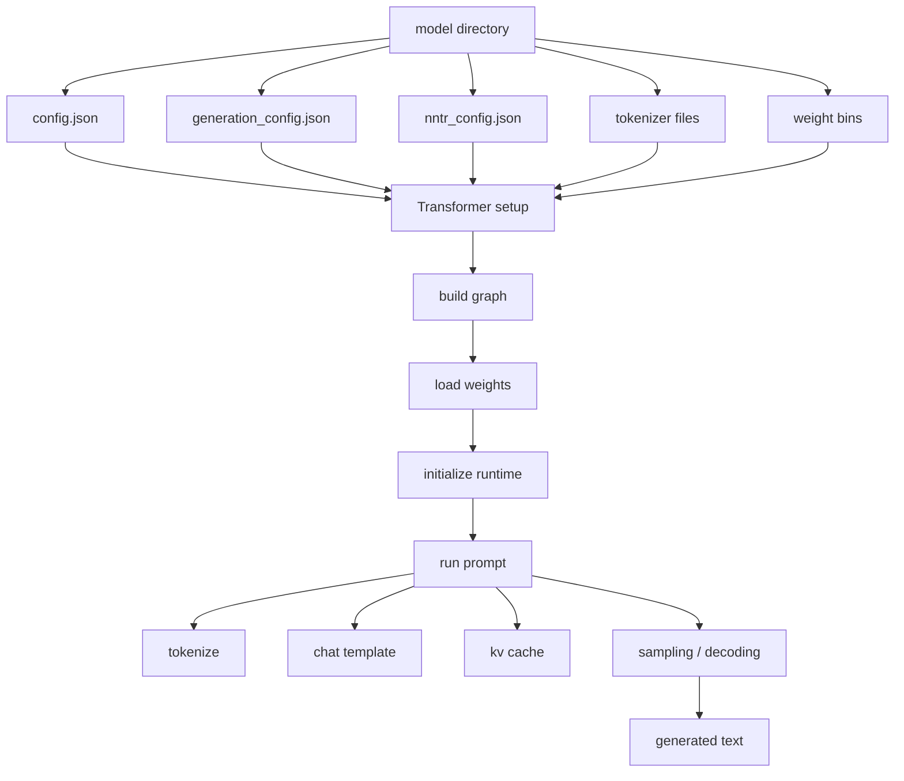

# L6 CausalLM Application Surface

> **Layer 6.** This page documents the most important application tree in the
> repository: `Applications/CausalLM/`. It is not a toy example. It is a full
> application stack with its own runtime hierarchy, model families, custom
> layers, resource conversion path, tokenizer integration, and platform build
> entry points.

---

## 1. Responsibility

Explain how the CausalLM application is assembled from the core `nntrainer`
library, where the important C++ model classes live, and how the model families
connect to each other.

This page answers questions like:

- What is the shared runtime?
- Which class owns prompt execution?
- Which class owns decoder-only generation?
- Where do the model families live?
- Where do the custom layers live?
- How are model resources converted and shipped?

---

## 2. CausalLM hierarchy



The implementation is centered around a C++ inheritance hierarchy:

1. `Transformer` is the shared base runtime.
2. `CausalLM` extends `Transformer` for decoder-only generation.
3. Model-family classes inherit from those bases and wire the actual
   architecture.
4. The application then uses the core nntrainer runtime to execute the graph.

---

## 3. Runtime layers

### 3.1 `transformer.*`

`Applications/CausalLM/models/transformer.h` and `transformer.cpp` define the
shared runtime foundation.

Responsibilities:

- parse model and generation config,
- load tokenizers,
- register custom layers,
- build the symbolic model graph,
- initialize and load weights,
- run prompt-to-output inference,
- expose metrics and model state.

Important design point:

- `Transformer` is not tied to one model family.
- It owns the common "model lifecycle" behavior.
- Derived classes customize only what they need: graph construction, layer
  wiring, and model-specific configuration.

### 3.2 `causal_lm.*`

`Applications/CausalLM/models/causal_lm.h` and `causal_lm.cpp` specialize the
shared runtime for decoder-only generation.

Responsibilities:

- construct the final LM-head stage,
- manage KV cache allocation and binding,
- generate tokens from logits,
- apply sampling and bad-word filtering,
- preserve generation state across iterations,
- expose the final generated text.

This is the main runtime class for the large language model path.

### 3.3 `models/<family>/`

Each family directory holds the architecture-specific implementation.

Typical examples:

- `qwen2/`
- `qwen3/`
- `qwen3_moe/`
- `qwen3_slim_moe/`
- `qwen3_cached_slim_moe/`
- `gpt_oss/`
- `gpt_oss_cached_slim/`
- `gemma3/`
- `timm_vit/`
- `deberta_v2/`

What these families usually provide:

- family-specific subclass of `Transformer` or `CausalLM`,
- family-specific graph assembly,
- custom attention/FFN/embedding wiring,
- custom layers when the core runtime does not already have the needed op,
- family-specific model config defaults and loading behavior.

### 3.4 `layers/`

The `layers/` directory contains the application-only layers that the model
families depend on.

Examples of responsibilities:

- attention helper layers,
- fused RMSNorm / MLP / embedding helpers,
- LM head helpers,
- pooling or projection layers used by specific model families,
- MoE-specific utility layers.

These are not generic nntrainer core layers. They are application-level
building blocks that support the CausalLM family tree.

### 3.5 `res/`

`res/` is the shipped model surface.

It contains:

- model configs,
- tokenizer files,
- generation configs,
- weight conversion scripts,
- model-specific README files,
- binaries created by the conversion scripts.

This directory is part of the runtime contract because the code assumes the
packaged files exist with the right names and layout.

---

## 4. CausalLM execution path



The important sequence is:

1. Load configs and tokenizer metadata.
2. Select the concrete model family class.
3. Build the symbolic graph through `Transformer` / `CausalLM`.
4. Load weights and bind custom layers.
5. Run inference and decode output tokens.

---

## 5. Key class relationships

```text
Transformer
  -> shared runtime, config, tokenizer, graph construction

CausalLM : Transformer
  -> decoder-only generation, KV cache, output decoding

<family> : CausalLM or Transformer
  -> architecture-specific graph and layer wiring

layers/*
  -> custom ops used by the families

main.cpp
  -> selects the concrete class and starts execution
```

The important thing to understand is that most of the interesting model logic
is not in the core library. It is implemented in the CausalLM model hierarchy.
The core library provides the execution engine; this application tree decides
what graph to execute.

---

## 6. Files that matter first

| File / folder | Why it matters |
|---|---|
| `main.cpp` | CLI entry point and config selection. |
| `models/transformer.*` | Shared runtime and graph assembly foundation. |
| `models/causal_lm.*` | Decoder-only generation and token loop. |
| `models/README.md` | Family index and model taxonomy. |
| `models/<family>/` | The actual implementation for each supported model family. |
| `layers/` | Application-specific layer implementations. |
| `res/` | Shipped model assets and conversion scripts. |
| `api/` | C API surface for embedding the runtime elsewhere. |
| `third_party/minja/` | Chat template engine used at runtime. |

---

## 7. Change checklist

- If you add a new model family, document where it sits in the hierarchy.
- If you change `Transformer` or `CausalLM`, update the runtime flow here.
- If you add or rename application layers, update the layer map.
- If you change the shipped resource layout, update the `res/` description.

---

## 8. Review focus

- Prefer reading this page before opening family code.
- This page should tell a reviewer where a change belongs.
- When a new model family is added, the family folder should be obvious from
  this map.
