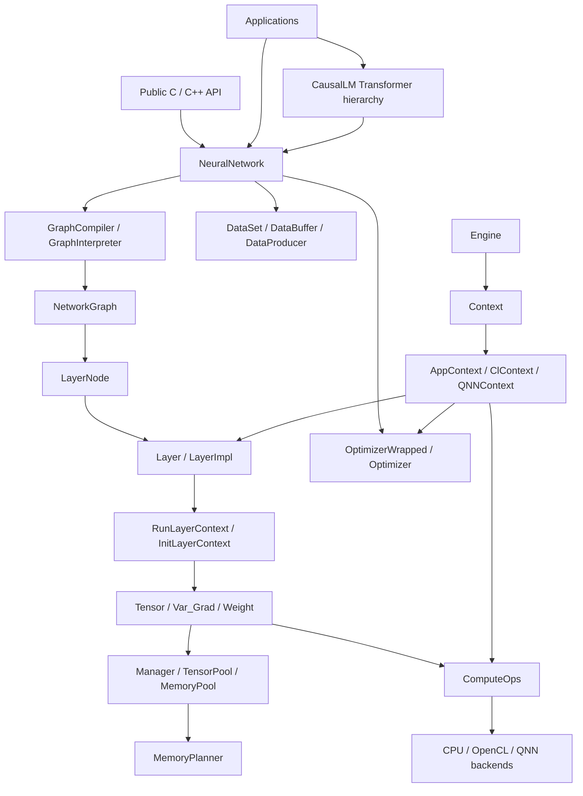
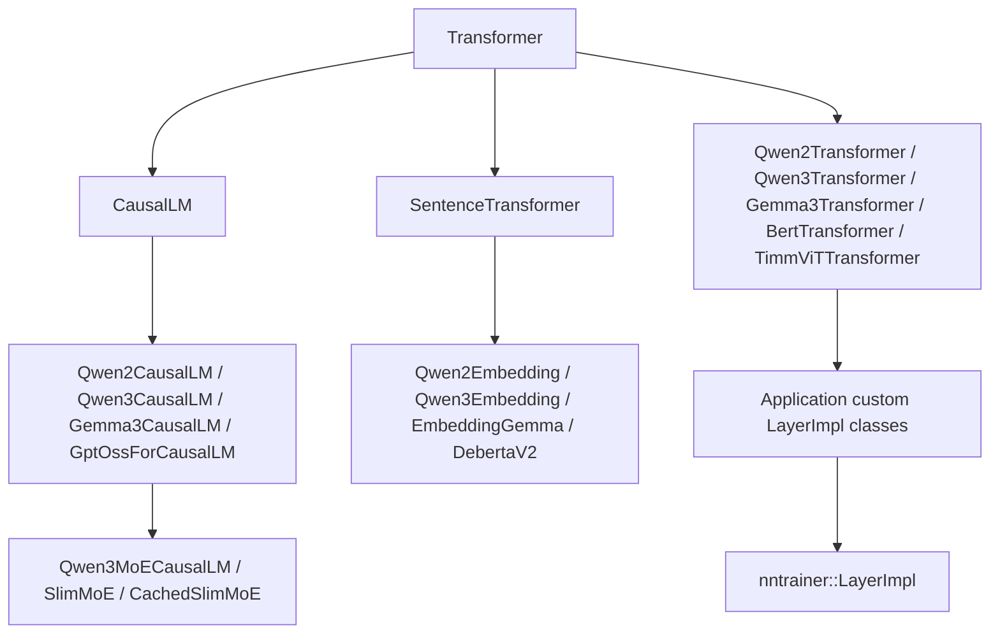

# L9 Global Class Map

> **Layer 9.** This page is the repository-wide class relationship map.
> It is paired with [`09-class-map-inventory.md`](09-class-map-inventory.md),
> a generated file-level declaration index, and
> [`09-source-file-coverage.md`](09-source-file-coverage.md), a generated list
> of all maintained source files scanned for class-like declarations. Read this
> page for structure and the generated files when you need exact coverage.

---

## 1. Responsibility

Document the class-level shape of the project so an agent can narrow the code
search before opening implementation files.

This page covers maintained source areas:

- `api/`
- `nntrainer/`
- `Applications/`
- `test/`
- `tools/`, `benchmarks/`, `nnstreamer/`, and platform resource helpers

Vendored, generated, and duplicated dependency snapshots such as
`subprojects/`, local worktrees, duplicated `json.hpp`, and `third_party/`
trees are dependency boundaries. They are summarized here instead of being
expanded as first-class nntrainer architecture.

---

## 2. Whole-project class flow



The important dependency direction is top-down:

- APIs and applications construct models.
- `NeuralNetwork` owns the model lifecycle.
- Compiler/interpreter code builds graph structure.
- `NetworkGraph` owns execution order.
- `LayerNode` adapts a concrete `Layer` into the graph.
- Layers use contexts to request tensors, weights, and backend ops.
- Tensor and memory classes own storage, dtype, lifetime, and dispatch.
- `Engine` and `Context` make layer/backend factories discoverable.

---

## 3. Core runtime map

### 3.1 API boundary

| Area | Key classes / types | Relationship |
|---|---|---|
| `api/capi/` | opaque C handles and internal structs | C ABI facade over core `nntrainer` objects. |
| `api/ccapi/include/model.h` | `ml::train::Model` | Public C++ model facade implemented by core `NeuralNetwork`. |
| `api/ccapi/include/layer.h` | `ml::train::Layer`, `LayerHandle` | Public layer wrapper that resolves to internal layer factories. |
| `api/ccapi/include/tensor_api.h` | `ml::train::Tensor`, `Tensor::Impl`, `LayerHandle` | Symbolic graph API facade. |
| `api/ccapi/include/optimizer.h` | `Optimizer`, `LearningRateScheduler` | Public wrappers around internal optimizer/scheduler classes. |
| `api/ccapi/include/dataset.h` | `Dataset` | Public dataset wrapper used by model training paths. |

The public API is intentionally thinner than the core runtime. It translates
user-facing handles and properties into internal `nntrainer` classes.

### 3.2 Model, compiler, and graph

| Cluster | Key classes | Relationship |
|---|---|---|
| Model lifecycle | `NeuralNetwork`, `ModelLoader`, `DynamicTrainingOptimization` | `NeuralNetwork` is the top-level runtime owner for compile, initialize, train, infer, save, and load. |
| Compiler | `GraphCompiler`, `GraphInterpreter`, `IniGraphInterpreter`, `TfliteInterpreter`, `ONNXInterpreter` | Interpreters read model descriptions; compiler and realizers normalize graph structure. |
| Realizers | `GraphRealizer`, `ActivationRealizer`, `InputRealizer`, `RecurrentRealizer`, `SliceRealizer`, `RemapRealizer`, `FlattenRealizer`, `MultioutRealizer`, `TfliteExportRealizer` | Realizers transform parsed graph definitions into executable graph nodes. |
| Graph core | `GraphCore`, `GraphNode`, `GraphNodeIterator`, `Connection`, `NetworkGraph` | `NetworkGraph` owns execution graph state and uses graph primitives for adjacency and ordering. |
| Layer graph node | `LayerNode final : ml::train::Layer, GraphNode` | Wraps one concrete internal `Layer` and adapts it to both the public layer facade and the graph node contract. |

Main relationship:

```text
NeuralNetwork
  -> GraphCompiler / GraphInterpreter
  -> NetworkGraph
  -> LayerNode
  -> Layer
```

`NetworkGraph` composes `GraphCore` and a shared `Manager`. `GraphCore`
contains the node adjacency and iteration machinery; `Manager` owns tensor,
weight, gradient, and optimizer-variable memory requests for the graph.

### 3.3 Layers

| Cluster | Key classes | Relationship |
|---|---|---|
| Layer interface | `Layer`, `LayerImpl`, `InitLayerContext`, `RunLayerContext` | Contract every trainable/executable layer follows. |
| Property system | `Property<T>`, `EnumProperty`, `PositiveIntegerProperty`, many `common_properties` classes | Layer/model/dataset/optimizer configuration is represented as typed property classes. |
| Common layer families | `InputLayer`, `FullyConnectedLayer`, `Conv1DLayer`, `Conv2DLayer`, `BatchNormalizationLayer`, `LayerNormalizationLayer`, `ActivationLayer`, `EmbeddingLayer`, recurrent layers, arithmetic layers | Most concrete core layers inherit from `Layer` or `LayerImpl`. |
| Operation layer bases | `UnaryOperationLayer`, `BinaryOperationLayer` | Shared bases for elementwise layers. |
| Plugin path | `PluggedLayer` and factory registration | External/custom layers are registered through `AppContext`/`Engine`. |

Layer classes do not own global execution. They declare tensor requirements in
`finalize()`, then use `RunLayerContext` during forward/backward execution.

### 3.4 Tensor, memory, and backend dispatch

| Cluster | Key classes | Relationship |
|---|---|---|
| Tensor model | `Tensor`, `TensorBase`, `TensorDim`, typed tensor classes | Tensor API, dtype/shape metadata, and data views. |
| Typed tensors | `FloatTensor`, `HalfTensor`, `UIntTensor`, `UInt16Tensor`, `UInt32Tensor`, `ShortTensor`, `CharTensor`, `Int4QTensor`, `UInt4Tensor`, `Q4_0_Tensor`, `Q4_K_Tensor`, `Q6_K_Tensor`, `BCQTensor` | Type-specific storage and math behavior. |
| Weights and gradients | `Weight : Var_Grad`, `Var_Grad` | Trainable parameters and gradient pairing. |
| Memory ownership | `Manager`, `TensorPool`, `MemoryPool`, `CachePool`, `CacheLoader`, `MMapedMemory` | Logical tensor lifetime and physical allocation. |
| Planning | `MemoryPlanner`, `BasicPlanner`, `OptimizedV1Planner`, `OptimizedV2Planner`, `OptimizedV3Planner` | Allocation reuse strategies. |
| Tasks | `Task`, `TaskExecutor`, `LazyTensor` | Deferred or scheduled tensor work. |
| Dispatch | `ComputeOps`, CPU backend implementations, OpenCL compute ops, QNN graph/op wrappers | Backend operation table used by tensors and layer contexts. |

Main relationship:

```text
Layer
  -> RunLayerContext
  -> Tensor / Weight / Var_Grad
  -> Manager / TensorPool / MemoryPool
  -> ComputeOps
  -> backend implementation
```

`TensorBase` carries `ContextData`, so backend identity lives on the concrete
tensor storage object rather than only on the public `Tensor` handle. Operation
results inherit compatible context data; incompatible non-null context data must
be handled explicitly rather than silently mixing backends.

### 3.5 Engine and backend contexts

| Class | Role |
|---|---|
| `Engine` | Singleton registry for contexts, layer factories, optimizer factories, and scheduler factories. |
| `Context` | Abstract factory and backend facade. |
| `ContextData` | Per-context payload holding allocator and `ComputeOps`. |
| `AppContext` | Default CPU application context and factory registry. |
| `ClContext` | OpenCL context and factory/allocator integration. |
| `QNNContext` | QNN plugin context and graph-oriented backend integration. |
| `MemAllocator` and derived allocators | Backend-specific allocation abstraction. |

Factory registration is the bridge from string-based layer/model properties to
concrete C++ classes.

Backend-specific helper classes worth recognizing:

- OpenCL: `ContextManager`, `CommandQueueManager`, `ClBufferManager`,
  `Buffer`, `Kernel`, and `Program`.
- QNN: `QNNVar`, `QNNBackendVar`, `QNNRpcManager`, and graph/op wrappers under
  the QNN JNI tree.
- CPU dispatch: `ComputeOps` is the base operation table; CPU/OpenCL/QNN paths
  override only supported operations and keep unsupported methods fail-fast.

### 3.6 Optimizers and datasets

| Cluster | Key classes | Relationship |
|---|---|---|
| Optimizer base | `Optimizer`, `OptimizerWrapped`, `RunOptimizerContext` | Optimizer execution contract and public API bridge. |
| Concrete optimizers | `SGD`, `Adam`, `AdamW`, `Lion`, `PluggedOptimizer` | Update `Weight`/`Var_Grad` using optimizer context. |
| Schedulers | `LearningRateScheduler`, `ConstantLearningRateScheduler`, `StepLearningRateScheduler`, `ExponentialLearningRateScheduler`, `CosineAnnealingLearningRateScheduler`, `LinearLearningRateScheduler` | Learning-rate policy plugged into optimizers. |
| Dataset base | `DataBuffer`, `DataProducer`, `Iteration`, `Sample`, `IterationQueue` | Training data production and batching. |
| Producers | `DirDataProducer`, `FuncDataProducer`, `RawFileDataProducer`, `RandomDataOneHotProducer` | Concrete data sources used by `DataBuffer`. |

The dataset path is:

```text
DataProducer
  -> Iteration / Sample
  -> IterationQueue
  -> DataBuffer
  -> NeuralNetwork training loop
```

---

## 4. Application class map

### 4.1 CausalLM



Key classes:

- `Transformer`: shared config, tokenizer, graph construction, initialize,
  weight load/save, and model lifecycle.
- `CausalLM`: decoder-only LM head, KV cache, generation, sampling, and output
  decoding.
- `SentenceTransformer`: embedding and sentence-vector runtime.
- Family classes: `Qwen2*`, `Qwen3*`, `Gemma3*`, `GptOss*`, `DebertaV2`,
  `BertTransformer`, `TimmViTTransformer`.
- Application layers: `MHACoreLayer`, `RMSNormLayer`, `SwiGLULayer`,
  `LmHeadLayer`, `EmbeddingLayer`, `TieWordEmbedding`,
  `ReshapedRMSNormLayer`, `MoELayer`, `SlimMoELayer`, cached MoE layers,
  `DebertaAttentionLayer`, pooling/normalization helpers.

CausalLM model families build graphs by composing `createLayer()` calls, then
letting the core `NeuralNetwork`/`NetworkGraph` runtime execute the result.

### 4.2 Other applications

| Area | Class pattern |
|---|---|
| Android samples | Java/Kotlin `Activity`, analyzer/trainer/tester classes, JNI bridge classes, and native helper structs wrap nntrainer models for mobile demos. |
| LLaMA and PicoGPT samples | Custom layer classes such as RMSNorm, rotary embedding, transposition, and MHA wrappers show application-owned layer extension. |
| Custom plugin samples | Custom `Layer` and `Optimizer` implementations demonstrate factory registration and plugin tests. |
| SimpleShot / YOLO / ResNet / MNIST / VGG / TransferLearning | Mostly example entry points and helper classes composing public API models. |
| `Applications/Layers` | Python/TensorFlow/PyTorch classes generate or compare layer behavior. |

These applications are consumers or examples. `Applications/CausalLM/` is the
largest application-level architecture and has dedicated documents L6-L8.

---

## 5. Test, tools, and integration classes

| Area | Class pattern |
|---|---|
| `test/unittest/` | GoogleTest fixtures, mock layers, mock optimizers, mock allocators, and typed test helpers. |
| `test/input_gen/` | Python recorder/generator classes used to build model test inputs and expected outputs. |
| `test/nnstreamer/` | Integration fixture classes for NNStreamer paths. |
| `tools/pyutils/` | Python utility classes/scripts for generated resources and build helpers. |
| `nnstreamer/` | Integration-facing structs/classes around NNStreamer plugin boundaries. |
| `benchmarks/` | Benchmark harness helpers. |

Tests should be read as executable documentation for component contracts. They
are indexed in [`09-class-map-inventory.md`](09-class-map-inventory.md) so an
agent can jump from a core class to the fixtures that exercise it.

---

## 6. Inheritance patterns to recognize

| Pattern | Meaning |
|---|---|
| `ConcreteLayer : Layer` | Direct implementation of layer lifecycle. |
| `ConcreteLayer : LayerImpl` | Implementation using shared layer helper behavior. |
| `Unary/Binary operation layer : Layer` | Shared base for elementwise operation families. |
| `ConcreteOptimizer : Optimizer` | Internal optimizer implementation. |
| `OptimizerWrapped : ml::train::Optimizer` | Public API bridge to internal optimizer. |
| `ConcreteScheduler : LearningRateScheduler` | Learning-rate policy implementation. |
| `ConcreteProducer : DataProducer` | Dataset source implementation. |
| `ConcreteTensor : TensorBase` | Typed tensor storage/behavior implementation. |
| `ConcretePlanner : MemoryPlanner` | Memory allocation planning strategy. |
| `ConcreteContext : Context` | Backend or app factory context. |
| `CausalLM family : CausalLM + family Transformer` | Application-level multiple inheritance used to combine runtime behavior with architecture-specific graph wiring. |

---

## 7. How to use the inventory

Use [`09-class-map-inventory.md`](09-class-map-inventory.md) when you need exact
declaration locations. Use [`09-source-file-coverage.md`](09-source-file-coverage.md)
when you need proof that a maintained source file was scanned even if it does
not declare a class-like type.

Recommended lookup flow:

1. Start with this file and identify the owning cluster.
2. Open the relevant L3 component doc or CausalLM L6-L8 doc.
3. Use the inventory to jump to the exact class declaration.
4. Read implementation files only after the class owner and relationship are
   clear.

The inventory is intentionally mechanical. If the generated index and this map
disagree, treat this map as stale and update it.

---

## 8. Maintenance rules

- Add a new class to the relevant component or application section when it
  changes ownership or architecture, not for every tiny helper.
- Keep vendor/generated code summarized as dependency boundaries.
- Update the generated inventory when source declarations move, are added, or
  are removed.
- Keep the overview graph focused on relationships that affect where an agent
  should search first.
